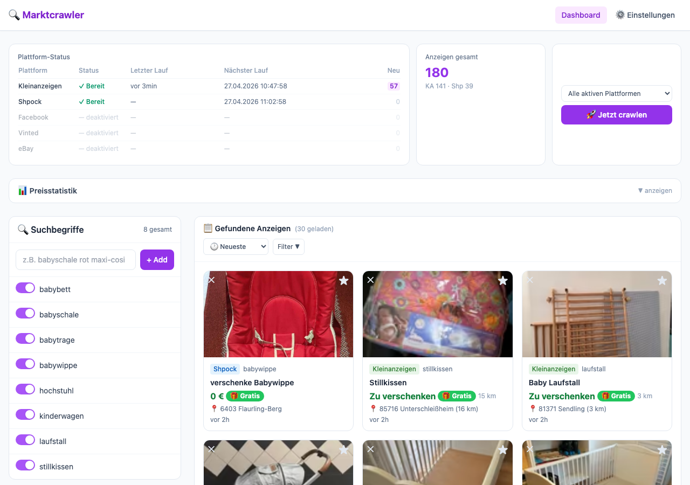
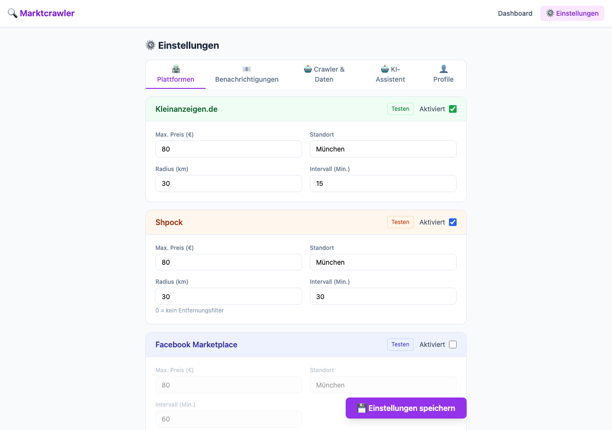
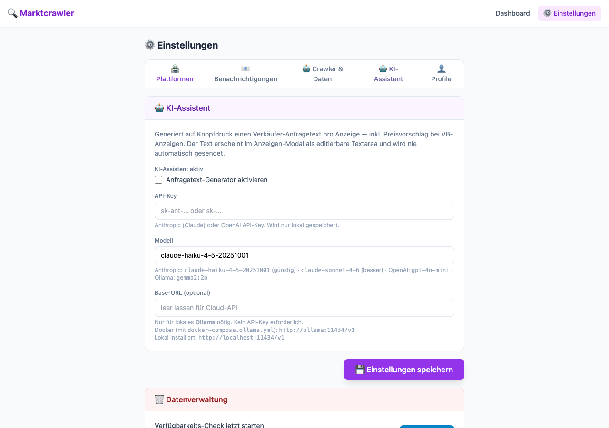

# 🔍 Marktcrawler

Ein selbst gehosteter Web-Crawler – durchsucht **Kleinanzeigen.de**, **Shpock**, **Vinted**, **eBay** und optional **Facebook Marketplace** automatisch nach beliebigen Suchbegriffen und benachrichtigt per E-Mail über neue Treffer.


---

## 📸 Vorschau

| Dashboard | Einstellungen | KI-Assistent |
|:---------:|:-------------:|:------------:|
|  |  |  |

---

## Schnellstart (Docker)

```bash
git clone https://github.com/descipar/baby-crawler.git marktcrawler
cd marktcrawler
docker compose up -d --build
```

Admin-UI aufrufen: **`http://localhost:5000`**

---

## ✨ Features

### Suche & Filterung
- **5 Plattformen** gleichzeitig: Kleinanzeigen.de, Shpock, Vinted, eBay, Facebook Marketplace (optional)
- **Suchbegriffe** per Klick hinzufügen, aktivieren/deaktivieren, löschen (Anzeigen werden mitgelöscht)
- **Blacklist** – Stichworte wie „defekt" oder „bastler" automatisch ausfiltern
- **Entfernungsfilter** – Radius pro Plattform konfigurierbar; Radius 0 = kein Filter
- **Altersfilter** – nur Anzeigen der letzten 3h / 6h / 24h / 48h anzeigen
- **Plattform-Filter** – nur eine Plattform anzeigen
- **Suchbegriff-Filter** – Klick auf einen Suchbegriff filtert die Anzeigenliste; mehrere Begriffe gleichzeitig auswählbar (Toggle); aktive Begriffe werden hervorgehoben
- **Exclude-Filter** – Begriffe live ausblenden (400 ms Debounce, ×-Button zum Zurücksetzen)
- **Duplikat-Erkennung** – jede Anzeige wird nur einmal gespeichert
- **👤 Mehrbenutzer-Profile** – Netflix-Stil: jedes Profil sieht „✨ Neu"-Badge für Anzeigen seit dem letzten Besuch; Suchbegriffe geteilt

### Anzeigen-Verwaltung
- **⭐ Favoriten** – Anzeigen markieren; Favoriten werden beim automatischen Aufräumen nie gelöscht
- **✕ Ausblenden** – einzelne Anzeigen dauerhaft verstecken; beim nächsten Crawl nicht wieder angezeigt
- **🎁 Gratis-Erkennung** – Anzeigen mit Preis 0 € / „zu verschenken" werden gesondert gekennzeichnet
- **📍 Entfernungsanzeige** – Luftlinie vom eigenen Standort zu jeder Anzeige (via OpenStreetMap)
- **Sortierung** – nach Datum, Preis (auf-/absteigend) oder Entfernung
- **Pagination** – 30 Anzeigen pro Seite, „Mehr laden"-Button
- **📋 Duplikat-Erkennung** – plattformübergreifend: gleicher Titel auf anderer Plattform wird als Amber-Badge markiert
- **💬 Notizfeld** – pro Anzeige eine private Notiz hinterlegen (editierbar im Detail-Modal)
- **💰 Preis-Schwelle pro Suchbegriff** – optionales Preislimit direkt am Suchbegriff, überschreibt Plattform-Limit
- **🔍 Detail-Modal** – Klick auf eine Karte öffnet Detailansicht mit Vollbild-Bild, Beschreibung und Notiz
- **⏱ Relative Zeitangaben** – „vor 2h" statt rohem Timestamp auf jeder Karte

### Benachrichtigungen & Automatisierung
- **E-Mail-Alert (gebündelt)** – alle 15 Min. wird eine E-Mail mit allen neuen Anzeigen verschickt, strukturiert nach Plattform → Suchbegriff mit Inhaltsverzeichnis; Gratis-Items grün hervorgehoben
- **Tages-Digest** – täglich zur konfigurierten Uhrzeit, unabhängig vom gebündelten Alert
- **Manueller Crawl** – per Knopfdruck (einzelne Plattform oder alle aktiven), Live-Log-Terminal, sofortige E-Mail bei neuen Treffern
- **Pro-Plattform-Scheduler** – jede Plattform hat ein eigenes konfigurierbares Intervall (z.B. Kleinanzeigen 15 Min., eBay 60 Min.), kein Cronjob nötig
- **🔍 Verfügbarkeits-Check** – prüft periodisch ob Anzeigen noch online sind (HTTP 404/410 → automatisch löschen, inkl. Favoriten)

### KI-Assistent
- **✨ Anfragetext-Generator** – generiert per Knopfdruck im Detail-Modal einen höflichen Kontakttext an den Verkäufer
- **💰 VB-Preisvorschlag** – bei „Verhandlungsbasis"-Anzeigen schlägt die KI automatisch einen Preis vor (basiert auf dem Durchschnitt deiner eigenen gesammelten Daten)
- **Drei Betriebsmodi** – Cloud-API (Claude/OpenAI) oder lokal via Ollama; einfach in den Einstellungen umschalten
- Text erscheint immer in einer **editierbaren Textarea**, wird nie automatisch gesendet

### Sonstiges
- **📊 Preisstatistik** – Durchschnitt, Min, Max und Gratis-Zähler pro Suchbegriff
- **📱 Mobil-optimiert** – responsive Layout, kollabierbare Sidebar, scrollbare Filter-Leiste
- **Docker-ready** – läuft auf jedem Linux-Server (Proxmox, Raspberry Pi, Cloud-VM)

---

## 🚀 Deployment

### Docker (empfohlen)

```bash
docker compose up -d --build   # Starten
docker compose logs -f          # Logs ansehen
docker compose down             # Stoppen
git pull && docker compose up -d --build  # Update
```

Bestehende Datenbanken werden automatisch migriert – keine Daten gehen verloren.

### Raspberry Pi 4

Stromsparend (~5 Watt), läuft still 24/7:

```bash
curl -fsSL https://get.docker.com | sh
sudo usermod -aG docker pi
git clone https://github.com/descipar/baby-crawler.git /home/pi/marktcrawler
cd /home/pi/marktcrawler
docker compose up -d --build
```

### Lokal (ohne Docker)

```bash
python -m venv venv
source venv/bin/activate        # Windows: venv\Scripts\activate
pip install -r requirements.txt
python run.py                   # http://localhost:5000
```

Die `.env`-Datei setzt `DATA_DIR=./data`. Optional: `SECRET_KEY=<langer-string>` für stabile Sessions.

---

## 🖥️ Admin-UI

### Dashboard

| Element | Funktion |
|---------|----------|
| Suchbegriff-Sidebar | Hinzufügen, aktivieren/deaktivieren, löschen (inkl. Anzeigen), als Filter-Klick |
| Filter-Leiste | Sortierung, Altersfilter, Plattform, Entfernung, Gratis, Favoriten, Exclude-Freitext |
| Anzeigen-Karte | Link zur Anzeige, ★ Favorit (AJAX), ✕ dauerhaft ausblenden (AJAX) |
| Status-Leiste | Crawl-Status, letzter/nächster Lauf, Gesamtzahl |
| 🚀 Jetzt crawlen | Startet manuellen Crawl mit Live-Log; E-Mail bei neuen Treffern |
| 📊 Preisstatistik | Aufklappbare Tabelle mit Avg/Min/Max pro Suchbegriff |
| Detail-Modal | Vollbild-Ansicht mit Bild, Beschreibung, Notiz-Textarea |
| Log-Terminal | Ein-/ausklappbar, startet automatisch beim manuellen Crawl |
| Filter-Panel | Aus-/einklappbar; aktive Filter-Anzahl als Badge |
| Status-Bar | Anzeigen pro Plattform, relativer Zeitstempel letzter Lauf |

### Einstellungen (`/settings`)

Die Einstellungsseite ist in fünf Tabs gegliedert: **Plattformen**, **Benachrichtigungen**, **Crawler & Daten**, **KI-Assistent**, **Profile**. Deaktivierte Plattformen werden optisch gedimmt. Der Speichern-Button ist sticky am Seitenende. Ungespeicherte Änderungen werden beim Verlassen der Seite mit einem Browser-Dialog gewarnt.

| Bereich | Tab | Konfigurierbar |
|---------|-----|---------------|
| Kleinanzeigen.de | Plattformen | Aktiviert, Max. Preis, Standort, Radius, Test-Button |
| Shpock | Plattformen | Aktiviert, Max. Preis, Standort, Radius (0 = kein Filter), Test-Button |
| Vinted | Plattformen | Aktiviert, Max. Preis, Standort, Radius (0 = kein Filter), Test-Button |
| eBay | Plattformen | Aktiviert, Max. Preis, Standort (PLZ oder Stadt), Radius, Test-Button |
| Facebook Marketplace | Plattformen | Aktiviert, Max. Preis, Standort |
| E-Mail | Benachrichtigungen | SMTP-Server/-Port, Absender, Empfänger (kommagetrennt), App-Passwort, Betreff |
| Tages-Digest | Benachrichtigungen | Aktiviert, Uhrzeit (z.B. `19:00`) |
| Crawler | Crawler & Daten | Max. Ergebnisse, Pause zw. Anfragen, Blacklist |
| Crawl-Intervall | Plattformen | Pro Plattform konfigurierbar (Min.); Kleinanzeigen 15, Shpock/Vinted 30, eBay/Facebook 60 |
| Anzeigen-Verwaltung | Crawler & Daten | Altersfilter (Anzeige), Anzeigen löschen die älter als X Stunden sind |
| Verfügbarkeits-Check | Crawler & Daten | Aktiviert, Intervall (Stunden), „Jetzt prüfen"-Button |
| Heimstandort | Crawler & Daten | Stadt für Entfernungsberechnung |
| KI-Assistent | KI-Assistent | Aktiviert, API-Key, Modell, Base-URL (für Ollama) |

---

## 📧 E-Mail einrichten

### Gmail

1. [App-Passwort erstellen](https://myaccount.google.com/apppasswords) (2FA muss aktiv sein)
2. In **Einstellungen → E-Mail** eintragen:
   - SMTP-Server: `smtp.gmail.com` · Port: `587`
   - Absender: `deine-adresse@gmail.com`
   - App-Passwort: *(das erzeugte App-Passwort)*
   - Empfänger: `kai@example.com, partner@example.com` (kommagetrennt)

### Weitere Anbieter

| Anbieter | SMTP-Server | Port |
|----------|-------------|------|
| GMX | mail.gmx.net | 587 |
| Web.de | smtp.web.de | 587 |
| Outlook | smtp.office365.com | 587 |

---

## 📘 Facebook Marketplace (optional)

Einmaliger interaktiver Login nötig:

```bash
docker exec -it marktcrawler python -c \
  "from app.scrapers.facebook import FacebookScraper; FacebookScraper({}).interactive_login()"
```

Danach Facebook in den Einstellungen aktivieren.

> ⚠️ Das automatische Auslesen von Facebook widerspricht den Nutzungsbedingungen. Nur für den privaten Gebrauch.

---

## 🤖 KI-Assistent einrichten

Der KI-Assistent generiert im Anzeigen-Modal per Klick auf „✨ Generieren" einen fertigen Anfragetext an den Verkäufer. Bei VB-Anzeigen (Verhandlungsbasis) schlägt er automatisch einen Preis vor — basierend auf dem Durchschnitt der eigenen gesammelten Daten.

Der Text erscheint immer in einer **editierbaren Textarea** und wird nie automatisch gesendet.

### Option 1: Cloud-API (empfohlen für Raspberry Pi)

Günstig und ohne lokale Ressourcen. Ein Anfragetext kostet ca. **0,00005 €** mit Claude Haiku.

**Anthropic (Claude):**
1. API-Key erstellen: [console.anthropic.com](https://console.anthropic.com)
2. In **Einstellungen → KI-Assistent** eintragen:
   - API-Key: `sk-ant-…`
   - Modell: `claude-haiku-4-5-20251001` (günstig) oder `claude-sonnet-4-6` (besser)
   - Base-URL: *(leer lassen)*

**OpenAI:**
- API-Key: `sk-…`
- Modell: `gpt-4o-mini`
- Base-URL: *(leer lassen)*

---

### Option 2: Lokal via Ollama

Vollständig offline, kein API-Key nötig. Benötigt mehr Hardware-Ressourcen.

> ⚠️ **Nicht für Raspberry Pi 4 geeignet.** Der RPi4 hat keine GPU – Ollama läuft nur auf der CPU und braucht **2–5 Minuten** pro Antwort. Für den RPi4 empfehlen wir Option 1 (Cloud-API).

**Mindestanforderungen:**
- x86_64-CPU, mind. 4 Kerne
- **8 GB RAM** (für `gemma2:2b`)
- Optional: NVIDIA-GPU für deutlich schnellere Ausgabe

**Empfohlene Modelle:**

| Modell | Größe | Qualität | RAM-Bedarf |
|--------|-------|----------|------------|
| `gemma2:2b` | 1,6 GB | gut | 4 GB |
| `phi3:mini` | 2,3 GB | besser | 6 GB |
| `qwen2.5:0.5b` | 400 MB | ausreichend | 2 GB |

**Einrichtung mit Docker (empfohlen):**

```bash
# Ollama als zweiten Container starten
docker compose -f docker-compose.yml -f docker-compose.ollama.yml up -d

# Modell laden (einmalig, ~1,6 GB Download)
docker exec marktcrawler-ollama ollama pull gemma2:2b
```

Danach in **Einstellungen → KI-Assistent**:
- Modell: `gemma2:2b`
- Base-URL: `http://ollama:11434/v1`
- API-Key: *(leer lassen)*

**Einrichtung lokal (ohne Docker):**

```bash
# Ollama installieren (Mac)
brew install ollama
ollama serve &
ollama pull gemma2:2b
```

Dann Base-URL auf `http://localhost:11434/v1` setzen.

---

## 🏗️ Architektur

```
marktcrawler/
├── Dockerfile / docker-compose.yml
├── requirements.txt / pytest.ini
├── run.py                  # Einstiegspunkt
├── data/                   # SQLite-DB (persistentes Volume)
├── tests/                  # 342 Unit-Tests
│   ├── conftest.py
│   ├── test_crawler.py     # _is_free(), _is_blacklisted()
│   ├── test_crawl_run.py   # run_crawl() inkl. per-term Preisfilter
│   ├── test_database.py    # CRUD, Migration, Notizen, Duplikate, Plattformzähler
│   ├── test_geo.py         # Haversine, Geocoding-Cache
│   ├── test_notifier.py    # E-Mail-Builder, Badges
│   ├── test_routes.py      # Alle Flask-Routen und REST-API
│   ├── test_scrapers.py    # Vinted, Shpock, eBay
│   └── test_checker.py     # Verfügbarkeits-Check, Running-Guard
└── app/
    ├── __init__.py         # Flask App Factory
    ├── database.py         # SQLite-Schicht (kein ORM, inkl. Migration)
    ├── routes.py           # Web-Routen & REST-API
    ├── crawler.py          # Crawl-Orchestrierung (Thread-safe)
    ├── checker.py          # Verfügbarkeits-Check (HEAD-Requests)
    ├── scheduler.py        # APScheduler: Crawl (pro Plattform) + Notify-Job + Digest + Checker
    ├── notifier.py         # E-Mail (gebündelter Alert + Sofort bei manuellem Crawl + Digest)
    ├── ai.py               # KI-Assistent: Anfragetext-Generator (Claude / OpenAI / Ollama)
    ├── geo.py              # Nominatim-Geocoding + Haversine
    ├── scrapers/
    │   ├── base.py         # Listing-Datenklasse + Hilfsfunktionen
    │   ├── kleinanzeigen.py
    │   ├── shpock.py
    │   ├── vinted.py
    │   ├── ebay.py
    │   └── facebook.py
    └── templates/          # Jinja2 + Tailwind CSS (CDN, kein Build-Step)
```

**Tech-Stack**: Python 3.12 · Flask 3 · APScheduler 3 · SQLite (kein ORM) · Tailwind CSS via CDN · Docker + Gunicorn

---

## 🔧 Entwicklung & Tests

```bash
# Tests ausführen
python -m pytest tests/ -v

# Einzelne Testdatei
python -m pytest tests/test_database.py -v
```

Alle Tests laufen ohne externe Abhängigkeiten (HTTP und DB werden gemockt).

---

## 💾 Backup & Wartung

```bash
# Datenbank sichern
cp ./data/baby_crawler.db ./backup_$(date +%Y%m%d).db

# Logs ansehen
docker compose logs -f marktcrawler
```

Anzeigen älter als 30 Tage werden automatisch bereinigt. **Favoriten werden dabei nie gelöscht.**

---

## 📄 Lizenz

[Creative Commons Attribution-NonCommercial 4.0 International (CC BY-NC 4.0)](https://creativecommons.org/licenses/by-nc/4.0/)

Frei nutzbar für private und nicht-kommerzielle Zwecke. Eine kommerzielle Nutzung ist nicht gestattet.

---

*Viel Erfolg bei der Schnäppchenjagd! 🔍*
